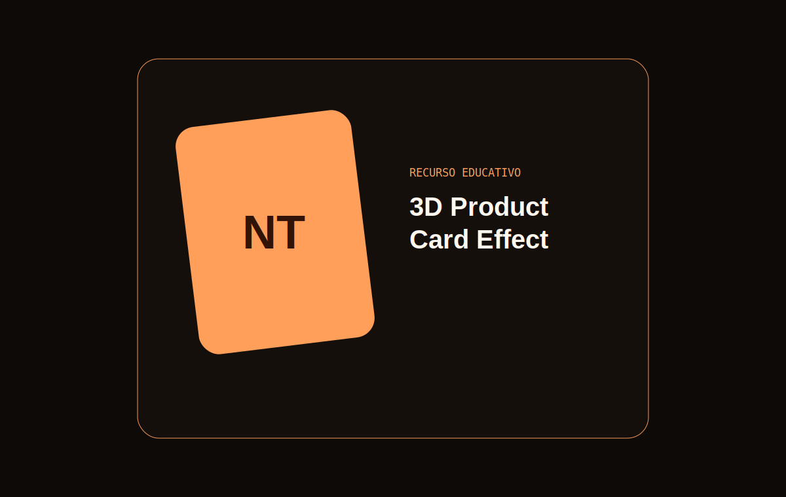

# 3D Product Card Effect

Tarjeta de producto con inclinación 3D, profundidad por capas, reflejo dinámico y retorno elástico.

## Características

- Perspectiva calculada según la posición del cursor.
- Reflejo sincronizado y retorno con curva spring.
- Botón táctil para demostrar la inclinación.
- Guarda de puntero fino y movimiento reducido.

## Demo en vivo

[3d-product-card-effect.netlify.app](https://3d-product-card-effect.netlify.app)

## Instalación

Clona el repositorio, entra en `3d-product-card-effect` y abre `index.html`.

## Estructura del proyecto

La interfaz vive en `index.html`, el volumen en `style.css`, la geometría en `script.js` y las vistas previas en `assets/`.

## Cómo personalizarlo

Cambia los límites de rotación, `perspective`, las capas `translateZ` y los tokens de color.

## Accesibilidad

La información permanece estable sin 3D, los controles son nativos y el movimiento se elimina al solicitarlo.

## Rendimiento

Usa transformaciones aceleradas, un único frame pendiente y ningún recurso externo.

## Licencia y créditos

[MIT](LICENSE). Creado por [Nacho Torres](https://github.com/NachoTorresRD) para [NTDESWEB](https://www.ntdesweb.com) con [NT-SKILL SUPREME](https://github.com/NachoTorresRD/nt-skill-supreme).

[Ver en GitHub](https://github.com/NachoTorresRD/3d-product-card-effect) · [Trabajar con NTDESWEB](https://www.ntdesweb.com)
